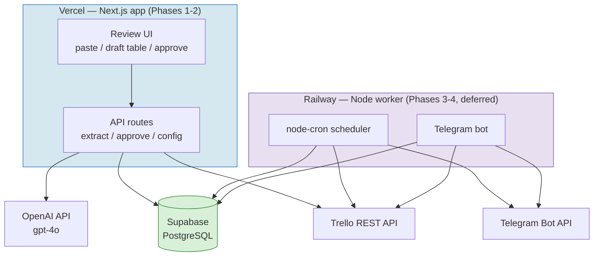

# MeeBo — Technical Blueprint (Cursor Implementation Guide)

> **Read this first, every session.** This is the single source of truth for building MeeBo. It is written to be pasted into Cursor. When implementing any ticket, follow the function signatures, schemas, and contracts here exactly. Do not invent alternative structures. If something is ambiguous, stop and ask — do not guess.

**Project in one sentence:** Paste meeting notes → OpenAI writes a summary and extracts tasks → the manager reviews → approved tasks become Trello cards filed under the correct project list and assigned to the correct member → (later) a Telegram bot tracks them.

---

## 0. Golden rules for the AI agent (Cursor)

1. **OpenAI only.** This project uses the OpenAI API (`gpt-4o`). There is no Anthropic/Claude anywhere. If you see a reference to Claude, it is a bug — flag it.
2. **TypeScript everywhere**, strict mode on.
3. **`packages/shared` is the contract.** Types and Zod schemas live there once. Never redefine `TaskDraft` in `web` or `worker`.
4. **One ticket at a time.** Implement only what the current ticket's *Done when* requires. Do not add features from future tickets.
5. **No silent failures.** Every external call (OpenAI, Trello, Telegram, Supabase) is wrapped in try/catch and surfaces a real error.
6. **All AI-generated output is in English**, even when the input notes are in Vietnamese (see §6).
7. **Idempotency is mandatory** on `/approve` (§9a) — double-clicking must never create two cards.
8. When unclear, re-read the relevant section here before writing code.

---

## 1. Current status (what's already done)

| Item | Status |
|------|--------|
| Supabase project created | ✅ Done (`mumtecnnwphdslvghocb`) |
| All 6 DB tables migrated | ✅ Done (§5) |
| `digest_log` sent_date index fix | ✅ Applied |
| Trello API key, token, board ID | ✅ Obtained (`TRELLO_BOARD_ID=a8dFBDdq`) |
| OpenAI API key | ✅ Obtained |
| Telegram bot | ⏸ Blocked (account flagged) — **Phases 3 & 4 deferred** |
| Vercel + GitHub | 🔜 In progress |
| Code implementation | 🔜 **Starts now — Phase 1** |

**Build focus: Phases 1 & 2 only for now.** Phases 3 & 4 (Telegram) are fully specified here but deferred until the Telegram account is restored.

---

## 2. Architecture at a glance

Two deployable runtimes + one shared database + external APIs. The split exists because the scheduler and Telegram bot are long-running processes that cannot run on Vercel serverless.



**Boundary rule:** the web app never talks to Telegram; the worker never serves UI. They share state only through Supabase. **Trello is the execution source of truth** — Supabase stores drafts, config, and logs only.

---

## 3. Settled decisions (do not re-litigate)

| # | Decision | Resolution |
|---|----------|------------|
| D1 | Runtime split | Next.js on Vercel (UI + API) + separate Node worker on Railway (bot + scheduler). |
| D2 | Trello data freshness | Read Trello **live** on each operation. No local mirror. |
| D3 | Web app auth | **Hardcoded secret URL/password in env** for now (`APP_SECRET`). Proper auth added later. No login page yet. |
| D4 | AI provider | **OpenAI `gpt-4o`**, model string in `OPENAI_MODEL` env var. |
| D5 | AI output language | **Always English**, regardless of input language. |
| D6 | **Trello lists = projects** | Lists are project/contract names (e.g. "MKV x Happyland", "PlaSight"), NOT status columns. AI detects the project per task; approve flow resolves-or-creates the list (§7). |
| D7 | New list creation | **Auto-create silently** when a project list doesn't exist. No confirmation gate. |
| D8 | Member assignment | Assign real Trello members by **member ID**, resolved once from emails via a setup script (§8). |
| D9 | Check-in routing | `pending_checkins` table maps a bot prompt to a Trello card (Phase 4). |

---

## 4. Repository structure

```
/
├── BLUEPRINT.md                  ← this file
├── README.md
├── package.json                  ← npm workspaces root
├── tsconfig.base.json            ← shared TS config + path aliases
├── .env.example
├── .gitignore                    ← MUST include .env, .env.local, node_modules
│
├── packages/
│   └── shared/
│       ├── package.json
│       ├── tsconfig.json
│       ├── schema.ts             ← TaskDraft Zod schema + ExtractionResponse (SINGLE SOURCE OF TRUTH)
│       ├── trello-mapping.ts     ← draftToTrelloCard() pure function
│       ├── retry.ts              ← withRetry() utility
│       └── supabase-types.ts     ← DB types (provided in §5)
│
├── apps/
│   ├── web/                      ← Next.js → Vercel
│   │   ├── package.json
│   │   ├── tsconfig.json
│   │   ├── next.config.js        ← transpiles packages/shared
│   │   ├── middleware.ts         ← APP_SECRET gate (D3)
│   │   ├── app/
│   │   │   ├── page.tsx                   ← paste input + draft review table
│   │   │   ├── settings/page.tsx          ← config screen (team + Trello)
│   │   │   └── api/
│   │   │       ├── extract/route.ts        ← POST notes → drafts
│   │   │       ├── drafts/route.ts         ← GET list, PATCH a draft
│   │   │       ├── approve/route.ts        ← POST approve → Trello card
│   │   │       └── config/route.ts         ← GET/PUT team + trello config
│   │   └── lib/
│   │       ├── openai.ts                   ← OpenAI client + extractTasksFromNotes()
│   │       ├── trello.ts                   ← TrelloClient
│   │       └── db.ts                        ← Supabase client (service role, server-side only)
│   │
│   └── worker/                   ← Node → Railway (DEFERRED — Phases 3-4)
│       ├── package.json
│       ├── tsconfig.json
│       ├── index.ts              ← boots scheduler + webhook server
│       ├── bot/  { webhook.ts, commands.ts, checkin.ts }
│       ├── scheduler/ { digest.ts, alerts.ts, stale.ts, vendor.ts,
│       │                checkin-send.ts, checkin-timeout.ts }
│       └── lib/ { telegram.ts, trello.ts, db.ts }
│
└── supabase/
    └── migrations/  { 001_initial.sql, 002_team_members.sql, 003_member_stats.sql }
```

**Note on web/lib/db.ts:** Because there is no real user auth yet (D3), the web app's API routes run server-side and use the **service role key**. The anon key is not used until proper auth is added. Never expose the service role key to the browser — it lives only in API routes and `middleware.ts`.

---

## 5. Database schema (already migrated — reference only)

All tables exist. This section is the canonical reference for column names and types. `supabase-types.ts` below must match exactly.

### task_drafts
Central table. Every extracted task lives here through its lifecycle.

| Column | Type | Null | Notes |
|--------|------|------|-------|
| id | uuid | ✕ | PK, `gen_random_uuid()` |
| extracted_title | text | ✕ | AI task title (English) |
| project | text | ✓ | Detected project/contract name → maps to Trello list |
| owner | text | ✓ | Owner name from notes (resolved to member at approve) |
| trello_member_id | text | ✓ | Resolved Trello member ID |
| due_date | date | ✓ | null if none inferable |
| priority | text | ✕ | `low` \| `medium` \| `high` |
| source_type | text | ✕ | `sprint_meeting` \| `customer_meeting` |
| context | text | ✕ | Background, English |
| definition_of_done | text | ✕ | Completion criteria, English |
| suggested_list | text | ✓ | Same as `project` — kept for clarity |
| checklist | jsonb | ✓ | `string[]` |
| decision_needed | boolean | ✕ | default false |
| confidence | text | ✕ | `high` \| `medium` \| `low` |
| needs_clarification | boolean | ✕ | true → blocked from one-click approval |
| meeting_summary | text | ✓ | Narrative summary (stored on first draft of a batch) |
| review_status | text | ✕ | `pending` \| `needs_clarification` \| `approved` \| `rejected` |
| trello_card_id | text | ✓ | Set after card creation — **idempotency key** |
| trello_card_url | text | ✓ | Link to created card |
| extracted_at | timestamptz | ✕ | default now() |
| reviewed_at | timestamptz | ✓ | When approved/rejected |
| original_source_text | text | ✕ | Raw sentence(s) that produced this draft |

### team_members
| Column | Type | Null | Notes |
|--------|------|------|-------|
| id | uuid | ✕ | PK |
| display_name | text | ✕ | e.g. "Member A" |
| email | text | ✓ | **Used to resolve trello_member_id (§8)** |
| trello_member_id | text | ✕ | 24-char hex — assignment target |
| telegram_user_id | text | ✓ | For Phase 4 DMs |
| role | text | ✕ | e.g. "Backend Developer" |
| skills | text[] | ✕ | For smart assignment |
| is_active | boolean | ✕ | default true |
| created_at | timestamptz | ✕ | default now() |

> **Migration note:** add `email text` to `team_members` if not already present:
> ```sql
> ALTER TABLE team_members ADD COLUMN IF NOT EXISTS email text;
> ```

### pending_checkins (Phase 4)
| Column | Type | Null | Notes |
|--------|------|------|-------|
| id | uuid | ✕ | PK, used as callback_data |
| trello_card_id | text | ✕ | Card asked about |
| member_id | uuid | ✕ | FK team_members.id |
| telegram_message_id | text | ✓ | Prompt message id |
| prompted_at | timestamptz | ✕ | default now() |
| reminder_sent_at | timestamptz | ✓ | 24h reminder |
| resolved_at | timestamptz | ✓ | null = awaiting |
| status | text | ✕ | `awaiting` \| `reminded` \| `resolved` \| `timed_out` |
| response | text | ✓ | `done` \| `in_progress` \| `blocked` |

### digest_log, trello_config, member_stats
```sql
-- digest_log (NOTE: sent_date column added to fix immutable-index error)
digest_log( id uuid pk, job_name text, reference_id text,
            sent_at timestamptz default now(),
            sent_date date not null default current_date )
UNIQUE INDEX (job_name, reference_id, sent_date)

-- trello_config: key-value store for board/list/label mapping
trello_config( key text pk, value text not null )

-- member_stats (Phase 4 learning loop)
member_stats( id uuid pk, member_id uuid fk, task_category text,
              total_assigned int, completed_on_time int,
              avg_days_to_complete float, last_updated timestamptz,
              UNIQUE(member_id, task_category) )
```

### supabase-types.ts (paste verbatim into packages/shared/)
```ts
export type Json = string | number | boolean | null | { [k: string]: Json } | Json[];

export interface Database {
  public: {
    Tables: {
      task_drafts: {
        Row: {
          id: string; extracted_title: string; project: string | null;
          owner: string | null; trello_member_id: string | null;
          due_date: string | null; priority: 'low' | 'medium' | 'high';
          source_type: 'sprint_meeting' | 'customer_meeting';
          context: string; definition_of_done: string;
          suggested_list: string | null; checklist: string[] | null;
          decision_needed: boolean; confidence: 'high' | 'medium' | 'low';
          needs_clarification: boolean; meeting_summary: string | null;
          review_status: 'pending' | 'needs_clarification' | 'approved' | 'rejected';
          trello_card_id: string | null; trello_card_url: string | null;
          extracted_at: string; reviewed_at: string | null;
          original_source_text: string;
        };
        Insert: Partial<Database['public']['Tables']['task_drafts']['Row']> &
          { extracted_title: string; priority: 'low'|'medium'|'high';
            source_type: 'sprint_meeting'|'customer_meeting';
            confidence: 'high'|'medium'|'low' };
        Update: Partial<Database['public']['Tables']['task_drafts']['Row']>;
      };
      team_members: {
        Row: {
          id: string; display_name: string; email: string | null;
          trello_member_id: string; telegram_user_id: string | null;
          role: string; skills: string[]; is_active: boolean; created_at: string;
        };
        Insert: Partial<Database['public']['Tables']['team_members']['Row']> &
          { display_name: string; trello_member_id: string; role: string };
        Update: Partial<Database['public']['Tables']['team_members']['Row']>;
      };
      pending_checkins: {
        Row: {
          id: string; trello_card_id: string; member_id: string;
          telegram_message_id: string | null; prompted_at: string;
          reminder_sent_at: string | null; resolved_at: string | null;
          status: 'awaiting' | 'reminded' | 'resolved' | 'timed_out';
          response: 'done' | 'in_progress' | 'blocked' | null;
        };
        Insert: Partial<Database['public']['Tables']['pending_checkins']['Row']> &
          { trello_card_id: string; member_id: string };
        Update: Partial<Database['public']['Tables']['pending_checkins']['Row']>;
      };
      member_stats: {
        Row: {
          id: string; member_id: string; task_category: string;
          total_assigned: number; completed_on_time: number;
          avg_days_to_complete: number | null; last_updated: string;
        };
        Insert: Partial<Database['public']['Tables']['member_stats']['Row']> &
          { member_id: string; task_category: string };
        Update: Partial<Database['public']['Tables']['member_stats']['Row']>;
      };
      digest_log: {
        Row: { id: string; job_name: string; reference_id: string | null;
               sent_at: string; sent_date: string };
        Insert: { job_name: string; reference_id?: string | null };
        Update: Partial<{ job_name: string; reference_id: string | null }>;
      };
      trello_config: {
        Row: { key: string; value: string };
        Insert: { key: string; value: string };
        Update: Partial<{ key: string; value: string }>;
      };
    };
  };
}
```

---

## 6. The extraction contract (OpenAI) — highest-leverage interface

### schema.ts (packages/shared/schema.ts)
```ts
import { z } from 'zod';

export const SourceType = z.enum(['sprint_meeting', 'customer_meeting']);
export const Priority   = z.enum(['low', 'medium', 'high']);
export const Confidence = z.enum(['high', 'medium', 'low']);

export const TaskDraftSchema = z.object({
  extracted_title:      z.string().min(1),
  project:              z.string().nullable(),   // detected project/contract name
  owner:                z.string().nullable(),
  due_date:             z.string().regex(/^\d{4}-\d{2}-\d{2}$/).nullable(),
  priority:             Priority,
  source_type:          SourceType,
  external_party:       z.string().nullable(),   // vendor/customer name if any
  context:              z.string(),
  definition_of_done:   z.string(),
  suggested_list:       z.string(),              // == project (the Trello list)
  checklist:            z.array(z.string()).nullable(),
  decision_needed:      z.boolean(),
  confidence:           Confidence,
  needs_clarification:  z.boolean(),
  original_source_text: z.string(),
});

export type TaskDraft = z.infer<typeof TaskDraftSchema>;

export const ExtractionResponse = z.object({
  summary: z.string(),               // English narrative, 3-5 sentences
  tasks:   z.array(TaskDraftSchema),
});
export type ExtractionResult = z.infer<typeof ExtractionResponse>;
```

### System prompt (lives in apps/web/lib/openai.ts)
```
You are MeeBo, a task-extraction assistant for a sports-tech team that manages
projects and third-party contracts on a Trello board.

ALWAYS respond in ENGLISH, even if the meeting notes are in another language
(e.g. Vietnamese). Translate as needed.

You will be given:
1. Meeting notes (sprint or customer meeting).
2. A list of EXISTING project names already on the Trello board.

Return ONLY a valid JSON object with this exact shape — no prose, no markdown:
{
  "summary": "<3-5 sentence English summary of the meeting>",
  "tasks": [ { ...TaskDraft fields... } ]
}

PROJECT DETECTION (critical):
- Each task belongs to a PROJECT (a third-party contract or initiative,
  e.g. "MKV x Happyland", "PlaSight", "Peekaboo").
- Set "project" to the project the task belongs to.
- If the project matches one of the EXISTING project names provided (even with
  minor spelling differences), use the EXISTING name exactly as given.
- If it is genuinely a new project, use a clean new name.
- "suggested_list" must equal "project".

TASK FIELDS:
- extracted_title: concise English action title
- owner: person responsible if named, else null
- due_date: YYYY-MM-DD if a date is stated or clearly inferable, else null
- priority: low | medium | high
- source_type: echo the input source_type
- external_party: the third-party/vendor/customer name, else null
- context: brief background in English
- definition_of_done: concrete completion criteria in English
- checklist: array of subtask strings, or null
- decision_needed: true if a decision is required before work can start
- confidence: your confidence this is a correct, actionable task
- original_source_text: the exact sentence(s) the task came from (original language ok)

SET needs_clarification = true IF ANY:
- owner not mentioned or ambiguous
- no due date can be inferred
- involves pricing, contracts, legal, or sensitive financial data
- requires boss/management approval before proceeding
- it is an idea or discussion point, not an actionable task

Return ONLY the JSON object.
```

**Server enforcement:** after parsing, if `needs_clarification === true`, the route sets `review_status = 'needs_clarification'`. Such drafts cannot be one-click approved until edited.

---

## 7. Project-list resolution (the core of D6/D7)

This is what makes MeeBo fit your board. It runs inside `/approve`, before card creation.

```ts
// Resolve the Trello list for a draft's project, creating it if absent.
// Lives in apps/web/lib/trello.ts as a TrelloClient method.
async resolveOrCreateList(projectName: string): Promise<string> {
  const lists = await this.getLists();                    // GET /1/boards/{id}/lists
  const match = lists.find(l =>
    l.name.trim().toLowerCase() === projectName.trim().toLowerCase()
  );
  if (match) return match.id;                              // existing project → use it
  const created = await this.createList(projectName);     // POST /1/boards/{id}/lists
  return created.id;                                       // new project → silent create (D7)
}
```

Flow inside `/approve`:
1. `listId = await trello.resolveOrCreateList(draft.project)`
2. `memberId = draft.trello_member_id` (resolved from owner via team_members)
3. `card = await trello.createCard({ ...mapping, idList: listId, idMembers: [memberId] })`
4. Idempotent DB write-back (§9a)

> Matching is case-insensitive and trimmed. We deliberately do NOT fuzzy-match beyond that (D7: auto-create, manual cleanup). The AI prompt already reuses existing names to minimise duplicates.

---

## 8. One-time member setup (email → Trello member ID)

Trello assigns members by **member ID**, not email. This script resolves the 5 emails you provide into member IDs and seeds `team_members`. Run once.

```ts
// scripts/seed-members.ts — run with: npx tsx scripts/seed-members.ts
// Resolves emails to Trello member IDs and upserts team_members.
const TEAM = [
  { display_name: 'Member A', email: 'a@example.com', role: 'Backend Developer',  skills: ['Node.js','PostgreSQL'] },
  { display_name: 'Member B', email: 'b@example.com', role: 'Frontend Developer', skills: ['React','TypeScript'] },
  // ...fill in all 5 with REAL emails
];

// 1. GET /1/boards/{BOARD_ID}/members?fields=id,fullName,username&key=..&token=..
//    (Trello board members do NOT expose email; match by fullName/username,
//     OR invite by email first, then map. See note below.)
// 2. For each TEAM entry, find the matching board member, take its `id`.
// 3. Upsert into team_members { display_name, email, trello_member_id, role, skills }.
```

> **Important Trello caveat:** the board-members endpoint returns `id`, `fullName`, `username` — **not email** (Trello hides emails for privacy). So matching is by `fullName` or `username`. Practical approach: the script prints the board's members (id + name + username); you confirm which member each email/person corresponds to, then it writes the mapping. I'll write this as an interactive step in the ticket. Provide the 5 emails AND each person's Trello display name/username so the mapping is unambiguous.

---

## 9. Key flows

### 9a. Capture → review → approve → card
```mermaid
sequenceDiagram
    participant M as Manager (web)
    participant API as Next.js API
    participant AI as OpenAI gpt-4o
    participant DB as Supabase
    participant T as Trello

    M->>API: POST /extract { source_text, source_type }
    API->>T: getLists() → existing project names
    API->>AI: system prompt + notes + existing projects
    AI-->>API: { summary, tasks[] } (English)
    API->>API: Zod validate; set needs_clarification
    API->>DB: insert drafts (pending / needs_clarification)
    API-->>M: summary + draft table
    M->>API: POST /approve { draft_id } (after edits)
    API->>DB: read draft (guard: trello_card_id IS NULL)
    API->>T: resolveOrCreateList(project) → listId
    API->>T: createCard(payload, idList=listId, idMembers=[memberId])
    T-->>API: card_id, url
    API->>DB: UPDATE ... WHERE trello_card_id IS NULL  (idempotency)
    API-->>M: ✅ card created (or already_approved)
```

**Idempotency (required):**
```sql
UPDATE task_drafts
SET trello_card_id = :cardId, trello_card_url = :url,
    review_status = 'approved', reviewed_at = now()
WHERE id = :draftId AND trello_card_id IS NULL
RETURNING *;
```
Zero rows returned → already approved → archive the just-created card, return `already_approved`.

### 9b. Check-in reply (Phase 4 — deferred)
Owner gets a DM with ✅/🔄/❌ inline buttons; `callback_data = pending_checkins.id`; tap resolves the row and posts a Trello comment.

### 9c. Daily digest (Phase 3 — deferred)
Cron reads Trello live, composes a grouped message, sends to the group, logs to `digest_log` keyed by `sent_date` (idempotent per day).

---

## 10. Build tickets

> Implement in order. Each is one Cursor session. Verify *Done when* before moving on. **Phases 1-2 are active; 3-4 are specified but deferred until Telegram is restored.**

### PHASE 1 — Foundation: Capture & AI Summary

**P1.T1 — Scaffold monorepo**
Create root `package.json` (npm workspaces: `apps/*`, `packages/*`), `tsconfig.base.json` with path aliases (`@shared/*` → `packages/shared/*`), `.gitignore` (`.env*`, `node_modules`, `.next`, `dist`), `.env.example` (§12), and empty workspace `package.json` + `tsconfig.json` files. `apps/web` is Next.js 14 App Router; `apps/worker` is a minimal Node entry (no-op for now).
*Done when:* `npm install` at root succeeds; `npm run dev -w apps/web` serves a blank Next.js page.

**P1.T2 — Shared package**
Create `packages/shared/schema.ts` (§6), `packages/shared/supabase-types.ts` (§5 verbatim), `packages/shared/retry.ts` (`withRetry` 3 attempts, backoff 1s/2s/3s). Export everything via a barrel `index.ts`.
*Done when:* `tsc --noEmit` in `packages/shared` passes; `import { TaskDraftSchema } from '@shared'` resolves from `apps/web`.

**P1.T3 — Supabase + middleware**
`apps/web/lib/db.ts`: typed Supabase client using `SUPABASE_URL` + `SUPABASE_SERVICE_ROLE_KEY` (server-only). `apps/web/middleware.ts`: gate all routes behind `APP_SECRET` (D3) — accept `?key=SECRET` once, set a cookie, block otherwise.
*Done when:* visiting the app without the secret is blocked; with `?key=…` it loads and stays unlocked.

**P1.T4 — OpenAI extraction**
`apps/web/lib/openai.ts`: `extractTasksFromNotes({ sourceText, sourceType, existingProjects })`. Uses `chat.completions.create` with `model: process.env.OPENAI_MODEL`, `response_format: { type: 'json_object' }`, the §6 system prompt, and injects `existingProjects` into the user message. Validate with `ExtractionResponse.safeParse`; throw a descriptive error (including raw output) on failure.
*Done when:* a 200-word sample transcript returns `{ summary, tasks }` where every task passes `TaskDraftSchema`, and pricing tasks get `needs_clarification: true`.

**P1.T5 — /api/extract route**
`POST /api/extract { source_text, source_type }`: fetch existing project names via `trello.getLists()`; call `extractTasksFromNotes`; insert drafts (`review_status` = `needs_clarification` where flagged, else `pending`); store `meeting_summary` on the batch. Return `{ summary, drafts }`. 422 on Zod failure, 500 on OpenAI/DB error.
*Done when:* posting the sample returns 200 with the summary and ≥3 drafts visible in Supabase with correct statuses.

**P1.T6 — Review UI**
`apps/web/app/page.tsx`: paste box + source-type dropdown; on submit, show the summary banner then an editable draft table (title, project, owner, due_date, priority) with status badges. `needs_clarification` rows highlighted; Approve disabled until owner + due_date set. `PATCH /api/drafts/[id]` saves edits.
*Done when:* manager pastes notes, sees summary + editable table; editing a flagged row enables its Approve button.

### PHASE 2 — Smart Assignment & Trello Integration

**P2.T1 — TrelloClient**
`apps/web/lib/trello.ts`: class with `getLists`, `createList`, `resolveOrCreateList` (§7), `getMembers`, `createCard`, `addChecklist`, `addComment`, `getCardsOnBoard`, `getOpenCardCountByMember`. Key+token auth; every call wrapped in `withRetry`.
*Done when:* a manual call creates a real card on board `a8dFBDdq` in the correct list.

**P2.T2 — Member seed script**
`scripts/seed-members.ts` (§8): list board members (id, fullName, username), map to the 5 provided emails/names, upsert `team_members`.
*Done when:* `team_members` has 5 rows each with a valid 24-char `trello_member_id`.

**P2.T3 — Smart assignment in extraction**
Add `buildTeamContext()` (members + skills + live open-card counts) and inject into the OpenAI prompt so each task gets a recommended `owner`. Low-confidence/overloaded → `needs_clarification`.
*Done when:* extraction recommends owners; a task for an overloaded member is flagged low-confidence.

**P2.T4 — draftToTrelloCard mapping**
`packages/shared/trello-mapping.ts`: pure `draftToTrelloCard(draft, member) → payload` with the English description template (context, definition of done, source, date). No list logic here (that's §7 at call time).
*Done when:* unit test produces the exact expected payload + description string.

**P2.T5 — /api/approve (idempotent + list resolve)**
`POST /api/approve { draft_id }`: resolve member from `owner`; `resolveOrCreateList(project)`; create card; idempotent write-back (§9a); archive duplicate if already approved.
*Done when:* approving creates exactly one card in the right project list assigned to the right member; double-click creates exactly one card.

**P2.T6 — Config screen**
`apps/web/app/settings/page.tsx` + `/api/config`: edit `team_members` (name, email, role, skills) and view resolved member IDs; view current Trello lists.
*Done when:* editing a member's skills changes the next extraction's assignment.

### PHASE 3 — Telegram Bot (DEFERRED until account restored)
Bot webhook + 5 cron jobs (digest 07:00, deadline alert 07:15, stale Mon 08:00, vendor 08:30) + 5 commands (`/overdue /today /waiting /blocked /summary`). Full spec retained from prior blueprint; build when Telegram is available.

### PHASE 4 — Check-in & Learning (DEFERRED)
Check-in prompts + inline-button replies → Trello comments; 24h reminder / 48h escalation; weekly learning loop → `member_stats` feeds back into assignment prompt.

---

## 11. Local development

```bash
# First time
npm install                          # installs all workspaces

# Run the web app (Phases 1-2)
npm run dev -w apps/web              # http://localhost:3000/?key=YOUR_APP_SECRET

# Type-check everything
npm run typecheck                    # tsc --noEmit across workspaces

# Run the member seed (once, after P2.T2)
npx tsx scripts/seed-members.ts
```

Add to root `package.json` scripts:
```json
{
  "scripts": {
    "dev": "npm run dev -w apps/web",
    "typecheck": "tsc --noEmit -p apps/web && tsc --noEmit -p packages/shared",
    "seed:members": "tsx scripts/seed-members.ts"
  }
}
```

---

## 12. Environment variables

`.env.example` (real values live in `.env.local` for web; **never commit**):
```properties
# Supabase (web API routes run server-side — service role only for now, D3)
SUPABASE_URL=https://mumtecnnwphdslvghocb.supabase.co
SUPABASE_SERVICE_ROLE_KEY=
NEXT_PUBLIC_SUPABASE_ANON_KEY=     # reserved for when real auth is added

# OpenAI
OPENAI_API_KEY=
OPENAI_MODEL=gpt-4o

# Trello
TRELLO_KEY=
TRELLO_TOKEN=
TRELLO_BOARD_ID=a8dFBDdq

# App access gate (D3 — make up any strong random string)
APP_SECRET=

# Telegram (Phases 3-4 — leave blank for now)
TELEGRAM_BOT_TOKEN=
TELEGRAM_GROUP_CHAT_ID=
TELEGRAM_WEBHOOK_SECRET=
```

⚠️ **Security:** if any secret is ever pasted into a chat, screenshot, or commit, revoke and regenerate it immediately. `.env.local` must be in `.gitignore`.

---

## 13. Risks & guardrails

- **Duplicate cards** → idempotent `/approve` (§9a). Highest-priority correctness risk.
- **Duplicate project lists** (typo "PlaySight" vs "PlaSight") → mitigated by AI reusing existing names + case-insensitive match; D7 accepts occasional manual cleanup.
- **Bad AI JSON** → strict Zod validation; malformed → 422, nothing written.
- **Sensitive tasks auto-flowing** → `needs_clarification` blocks one-click approval for pricing/legal/contract items.
- **Member mismatch** → emails don't expose via Trello API; seed script maps by name/username with human confirmation (§8).
- **Service-role key exposure** → used only server-side in API routes; never shipped to browser.
- **Trello rate limits** → live reads are fine at this scale; add caching only if hit.

---

*MeeBo Blueprint v2.0 — OpenAI-only, Cursor-optimized. Active scope: Phases 1-2. Start at P1.T1.*
