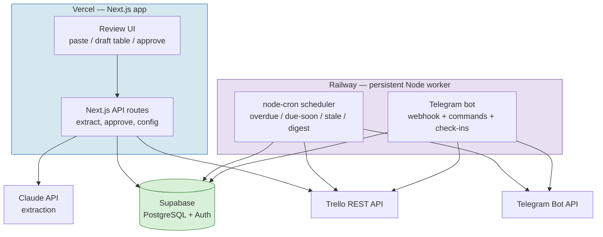
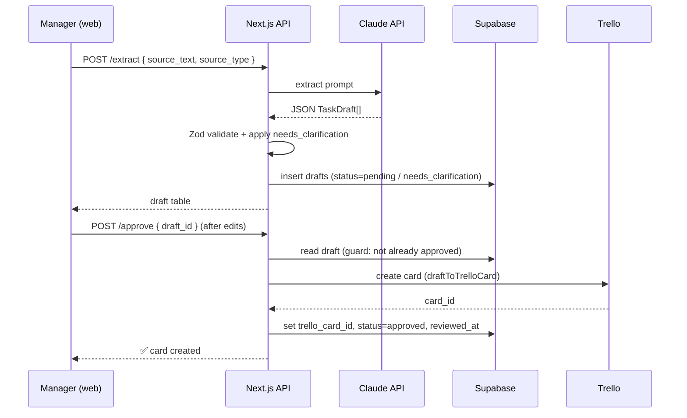
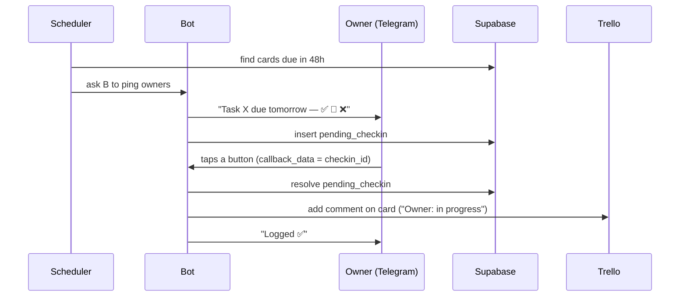

# System Architecture Blueprint
## AI-Assisted Trello Task Capture & Hygiene Automation

> Companion to **Product Design Spec v1.0**. The spec defines *what* we build; this blueprint defines *how it's structured and in what order*, and gives an AI coding agent (Cursor) discrete, verifiable tickets to execute.

---

## 0. How to use this document

Per your tooling rule — *Claude thinks, Cursor types* — this file is the hand-off artifact. Workflow:

1. Drop this file in the repo root as `BLUEPRINT.md`.
2. For each ticket in §9, paste the ticket + the relevant interface contract (§5–§8) into Cursor with `@codebase`.
3. Cursor implements; you verify against the ticket's **Done when** criteria before moving on.
4. Architecture changes come back here (or to Claude) — never improvised in Cursor.

**Open decisions that need your sign-off before Week 1** are collected in §2. Everything else is a defaulted assumption, marked `[ASSUMPTION]`, that you can override.

---

## 1. Architecture at a glance

The system is **two deployable runtimes** plus one shared database and three external APIs. This split is forced by the fact that a scheduler and a Telegram bot are long-running processes and cannot live in Vercel serverless functions.



**Boundary rule:** the web app never talks to Telegram, and the worker never serves UI. They communicate only through Supabase (shared state) and Trello (source of truth). This keeps each runtime independently deployable and testable.

---

## 2. Decisions needing your sign-off

| # | Decision | Default taken | Override if… |
|---|----------|---------------|--------------|
| D1 | **Runtime split** — Next.js on Vercel for UI+light API; separate Node worker on Railway for bot+scheduler. | Adopted (only coherent reading of the spec). | You'd rather run *everything* as one Node/Express service on Railway and serve the UI from it too (simpler ops, loses Vercel's free CDN). |
| D2 | **Trello data freshness** — scheduler reads Trello **live** on each scan rather than syncing a local mirror. | Live reads (simpler, no sync drift). | Scan volume hits Trello rate limits — then add a lightweight `card_cache` sync. |
| D3 | **Web app auth** — single-manager login via Supabase Auth magic link. | Magic link. | You prefer a single shared password / IP allowlist for a team this small. |
| D4 | **Bot transport** — Telegram **webhook** (worker exposes one HTTPS route). | Webhook (Railway gives a public URL). | You're behind a firewall with no public URL → switch to long-polling (`getUpdates`). |
| D5 | **Check-in routing** — new `pending_checkins` table maps a bot prompt to a Trello card (§6). | Added to schema. | — (this is a required gap fix, not optional). |
| D6 | **AI model** — model string is a config env var (`CLAUDE_MODEL`), not hardcoded, so it can be updated without a code change. | Config-driven. | — |

---

## 3. Repository structure

A single monorepo with two apps and one shared package keeps the Claude extraction schema and Supabase types in exactly one place.

```
/
├── BLUEPRINT.md                ← this file
├── README.md
├── package.json                ← workspaces: web, worker, shared
├── .env.example
├── packages/
│   └── shared/
│       ├── schema.ts           ← TaskDraft type + Zod schema (single source of truth)
│       ├── trello-mapping.ts   ← draft → Trello card field mapping (§7)
│       └── supabase-types.ts   ← generated from DB
├── apps/
│   ├── web/                    ← Next.js → Vercel
│   │   ├── app/
│   │   │   ├── page.tsx                 ← paste input + draft review table
│   │   │   └── api/
│   │   │       ├── extract/route.ts     ← POST raw text → drafts
│   │   │       ├── drafts/route.ts      ← GET list, PATCH status
│   │   │       ├── approve/route.ts     ← POST approve → create Trello card
│   │   │       └── config/route.ts      ← GET/PUT trello_config maps
│   │   └── lib/
│   │       ├── claude.ts                ← extraction call
│   │       ├── trello.ts                ← Trello client wrapper
│   │       └── db.ts                    ← Supabase client
│   └── worker/                 ← Node → Railway
│       ├── index.ts            ← boots scheduler + bot webhook server
│       ├── scheduler/
│       │   ├── overdue.ts
│       │   ├── due-soon.ts
│       │   ├── digest.ts
│       │   ├── stale.ts
│       │   └── vendor-followup.ts
│       └── bot/
│           ├── commands.ts     ← /overdue /today /waiting /blocked /summary
│           ├── checkin.ts      ← prompt owner, parse ✅/🔄/❌ reply
│           └── webhook.ts      ← Telegram update handler
└── supabase/
    └── migrations/             ← SQL migrations
```

`[ASSUMPTION]` TypeScript throughout. The `shared` package is the contract both runtimes import, so the draft shape can never drift between the UI and the worker.

---

## 4. Component responsibilities (one line each)

| Component | Owns | Must NOT |
|-----------|------|----------|
| `web/app/page.tsx` | Paste box, draft table, approve buttons, config screen | Talk to Telegram or run jobs |
| `api/extract` | Call Claude, validate output against Zod schema, insert `pending` drafts | Create Trello cards |
| `api/approve` | Map draft → card, call Trello, write back `trello_card_id`, set status `approved` | Re-extract; create duplicate cards (idempotency in §8) |
| `worker/scheduler` | Run cron jobs, read Trello live, build digests, send via bot | Serve HTTP UI |
| `worker/bot` | Handle commands, send check-ins, parse replies → Trello comment | Create cards from drafts (that's the manager's job) |
| `shared/schema` | The one canonical `TaskDraft` type + validation | — |
| Supabase | All persistent state: drafts, config, digest log, pending check-ins | Hold Trello execution truth (Trello owns that) |

---

## 5. The extraction contract (Claude API)

This is the highest-leverage interface — get the schema right and most of the system falls into place.

**Input:** `{ source_text: string, source_type: enum }`

**Output:** a JSON array of `TaskDraft` objects matching `shared/schema.ts`. The prompt must instruct the model to return **only** JSON (no prose, no markdown fences), and the worker must parse-and-validate with Zod, rejecting anything malformed.

```ts
// packages/shared/schema.ts (abridged — fields per spec §6)
export const TaskDraft = z.object({
  extracted_title: z.string(),
  project: z.string(),
  owner: z.string().nullable(),
  due_date: z.string().date().nullable(),
  priority: z.enum(["low", "medium", "high"]),
  source_type: z.enum(["meeting","vendor","customer","boss","chat","email"]),
  external_party: z.string().nullable(),
  context: z.string(),
  definition_of_done: z.string(),
  suggested_list: z.string(),
  checklist: z.array(z.string()).nullable(),
  decision_needed: z.boolean(),
  confidence: z.enum(["high", "medium", "low"]),
  original_source_text: z.string(),
  needs_clarification: z.boolean(),  // ← derived from spec §6 rules
});
```

**Needs-clarification rules (spec §6)** are enforced by the *prompt*, and `needs_clarification: true` forces `review_status = 'needs_clarification'` server-side — these drafts are never one-click approvable until the manager edits them. The trigger conditions (unclear owner, no inferable due date, idea-not-task, pricing/legal/finance/contract, sensitive, needs boss approval) go verbatim into the system prompt.

---

## 6. Data model — additions to spec §9

Keep all three spec tables (`task_drafts`, `trello_config`, `digest_log`) exactly as written. Add **one** table to fix the check-in routing gap (D5):

```sql
-- maps an outgoing bot check-in to the card it asks about,
-- so an inbound ✅/🔄/❌ reply can be resolved to a Trello card
create table pending_checkins (
  id            uuid primary key default gen_random_uuid(),
  trello_card_id text not null,
  telegram_user_id text not null,
  telegram_message_id text,        -- the prompt message, for reply matching
  prompted_at   timestamptz default now(),
  resolved_at   timestamptz,        -- null = still awaiting reply
  response      text                -- 'done' | 'in_progress' | 'blocked' | null
);
```

If using inline keyboard buttons (recommended over free-text replies), the card id can also ride in Telegram `callback_data` — but the table is still needed to enforce "one open prompt per card" and to time out stale prompts.

---

## 7. Trello card mapping

Already fully specified in spec §7. Implement it once in `shared/trello-mapping.ts` as a pure function `draftToTrelloCard(draft, config) → TrelloCardPayload` so both the web approve route and any future re-sync use identical logic. The fixed markdown description template from spec §7 lives here as a single string builder.

---

## 8. Key flows

### 8a. Capture → review → card



**Idempotency (required):** `/approve` must refuse to act if `trello_card_id` is already set on the draft. This prevents double-tap duplicate cards. Use a DB-level conditional update (`update ... where trello_card_id is null returning *`) — if zero rows return, the card already exists.

### 8b. Check-in reply



### 8c. Daily digest

`overdue.ts` (7:30) and `due-soon.ts` (7:45) write findings; `digest.ts` (8:00) reads Trello live, composes the group message, sends via bot, and logs to `digest_log`. Each job is independent and idempotent — re-running it the same day overwrites that day's `digest_log` row rather than duplicating.

---

## 9. Build sequence — agent-executable tickets

Aligned to spec §5/§10 phases. Each ticket is scoped to be implementable in one Cursor session with a clear **Done when**.

### Week 1 — V1: Capture + Review
- **T1.1 Scaffold monorepo** — workspaces `web`, `worker`, `shared`; `.env.example`; Supabase client. *Done when:* `npm run dev` boots the web app and a no-op worker.
- **T1.2 DB migration** — all spec §9 tables + `pending_checkins`. *Done when:* migration applies clean; `supabase-types.ts` generated.
- **T1.3 Extraction schema** — `shared/schema.ts` Zod object. *Done when:* unit test parses a valid sample and rejects a malformed one.
- **T1.4 Extraction prompt + `/extract` route** — call Claude, validate, insert drafts, enforce needs-clarification rules. *Done when:* pasting a 3-task sample transcript yields ≥3 validated drafts in the DB with correct `needs_clarification` flags.
- **T1.5 Review table UI** — paste box, table of drafts, editable fields, status badges. *Done when:* manager can paste text and see the extracted draft table render.

### Week 2 — V2: Trello integration
- **T2.1 Trello client wrapper** — auth (key+token), create card, add checklist, set due/labels/members. *Done when:* a test card appears on the real board.
- **T2.2 `trello-mapping.ts`** — pure `draftToTrelloCard` + the §7 description template. *Done when:* unit test produces the exact markdown structure.
- **T2.3 `/approve` route with idempotency** — conditional update guard (§8a). *Done when:* approving creates one card; double-clicking creates exactly one card.
- **T2.4 Config screen** — edit `trello_config` label/member maps. *Done when:* manager can map team names → Trello member IDs from the UI.

### Week 3 — V3: Telegram bot + digest
- **T3.1 Bot boot + webhook** — worker exposes webhook route; registers with Telegram. *Done when:* bot responds to `/start` in the group.
- **T3.2 Scheduled scans** — `overdue`, `due-soon`, `digest` cron jobs reading Trello live. *Done when:* digest message posts to the group at the scheduled time (or via a manual trigger in dev).
- **T3.3 On-demand commands** — `/overdue /today /waiting /blocked /summary`. *Done when:* each returns correct live data.

### Week 4 — V3+: Check-in flow
- **T4.1 Check-in prompts** — `due-soon` triggers owner pings with inline buttons; writes `pending_checkins`. *Done when:* owner receives a ping with three buttons.
- **T4.2 Reply handling** — resolve `pending_checkin`, post Trello comment. *Done when:* tapping a button adds a comment to the right card and confirms to the owner.
- **T4.3 Stale + vendor-followup scans** — Monday stale scan, daily waiting>3d scan. *Done when:* stale cards surface in the weekly summary.

### Buffer — Polish & deploy
- **T5.1** Error handling + retries on all external calls (Claude/Trello/Telegram).
- **T5.2** Deploy: web → Vercel, worker → Railway, set Telegram webhook to Railway URL, all secrets configured.
- **T5.3** README + 5-member onboarding (each does one-time private `/start` with the bot).

---

## 10. Configuration & secrets

`.env.example` (never commit real values; Vercel and Railway each hold their own copy):

```
# Supabase (both runtimes)
SUPABASE_URL=
SUPABASE_SERVICE_ROLE_KEY=     # worker only
NEXT_PUBLIC_SUPABASE_ANON_KEY= # web only
# Claude
ANTHROPIC_API_KEY=
CLAUDE_MODEL=                  # config-driven per D6
# Trello
TRELLO_KEY=
TRELLO_TOKEN=
TRELLO_BOARD_ID=
# Telegram
TELEGRAM_BOT_TOKEN=
TELEGRAM_WEBHOOK_SECRET=
```

`[ASSUMPTION]` The worker uses the Supabase **service role** key (trusted server, no row-level-security needed at this team size); the web app uses the anon key behind manager auth (D3).

---

## 11. Risks & guardrails

- **Duplicate cards** → idempotent `/approve` (§8a). *Highest-priority correctness risk.*
- **Bad AI output breaking the table** → strict Zod validation; malformed drafts are dropped and surfaced, never silently stored.
- **Sensitive tasks auto-flowing to Trello** → `needs_clarification` (pricing/legal/sensitive) blocks one-click approval by design.
- **Trello rate limits** from frequent scans → start with live reads (D2); add caching only if you actually hit limits.
- **Lost check-in replies** → `pending_checkins` with a `prompted_at` timeout so stale prompts don't linger.
- **Worker downtime = no digests** → Railway healthcheck + restart; digests are idempotent so a restart mid-job is safe.

---

*Blueprint v1.0 — companion to Product Design Spec v1.0. Confirm the §2 decisions, then start at T1.1.*
