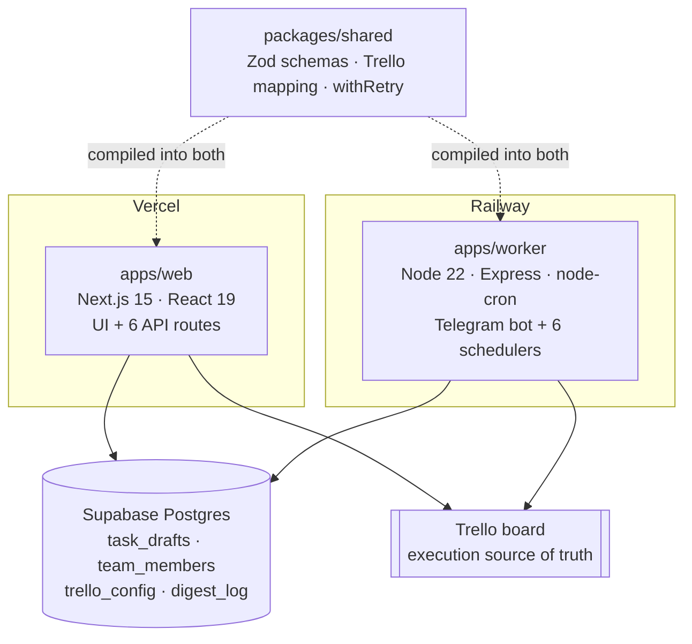
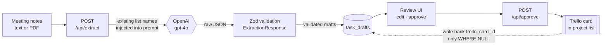

# MeeBo — AI-Assisted Trello Task Capture & Hygiene Automation


Meeting notes go in, reviewed Trello cards come out. Paste raw notes (or upload a PDF), and
`gpt-4o` writes a summary and extracts structured task candidates — title, owner, due date,
priority, definition of done. A manager reviews the drafts in a web UI, fixes anything the model
flagged as ambiguous, and approves. Only then does anything reach Trello, filed under the right
project list and assigned to the right member.

The design premise is that AI should never write directly to the board. Extraction is cheap and
occasionally wrong; a Trello card is a commitment someone is accountable for. So a human approval
gate sits between them, and low-confidence extractions are blocked from one-click approval
entirely.

## Architecture

Two independently deployable runtimes share one Postgres database and never call each other. All
coordination happens through Supabase, so either side can be redeployed or taken offline without
breaking the other.



Neither runtime holds a reference to the other. `web` never touches Telegram, `worker` never serves
UI, and all shared state passes through Postgres.

### Core flow: extract → review → approve



1. `POST /api/extract` receives raw notes plus a `source_type` (`sprint_meeting` or
   `customer_meeting`).
2. Before prompting the model, the route reads the board's **existing** list names live from Trello
   and injects them into the prompt, so the AI reuses real project names instead of inventing
   near-duplicates like "Happyland" alongside "MKV x Happyland".
3. The model returns `{ summary, tasks[] }`, validated against Zod. Every optional field uses
   `.catch()` fallbacks, so one malformed field degrades to a default rather than discarding the
   whole batch.
4. Drafts land in `task_drafts`. Anything the model marks `needs_clarification` gets
   `review_status = 'needs_clarification'` and is excluded from bulk approval.
5. The manager edits flagged drafts in the UI, then approves.
6. `POST /api/approve` resolves or creates the project list, creates the card, then writes back
   `trello_card_id` — the write-back is guarded so a double-click cannot produce two cards.

## Tech stack

| Layer | Technology |
|---|---|
| Language | TypeScript 5.8, `strict: true` across all three workspaces |
| Web | Next.js 15.3 (App Router), React 19.1 |
| Worker | Node.js 22, Express 4.21, node-cron 3.0 |
| Validation | Zod 3.24 — one schema, shared by both runtimes |
| AI | OpenAI SDK 4.103, `gpt-4o` (configurable via `OPENAI_MODEL`) |
| Database | Supabase (PostgreSQL) via `supabase-js` 2.49 |
| Input parsing | `pdf-parse` 2.4 for PDF meeting notes |
| External APIs | Trello REST, Telegram Bot API |
| Build tooling | npm workspaces, tsx, esbuild |
| Hosting | Vercel (web), Railway (worker), Supabase (database) |

## Repository layout

```
apps/web/            Next.js app — UI, API routes, all external integrations
  app/api/           extract · approve · drafts · config · resolve-trello-member
  lib/               Supabase client (service role, server-only) · Trello client
  middleware.ts      APP_SECRET access gate
apps/worker/         Node process — Telegram bot + cron schedulers
  bot/               capture · check-ins · commands · webhook
  scheduler/         digest · alerts · overdue · due-soon · stale · vendor
packages/shared/     Zod schemas, Supabase types, Trello mapping, retry helper
supabase/migrations/ SQL migrations
scripts/             seed-members.ts — resolves Trello member IDs
```

`packages/shared` is a hard boundary, not a convenience. `TaskDraft`, `ExtractionResponse`,
`draftToTrelloCard()`, and `withRetry()` are defined there exactly once. Neither `web` nor `worker`
is permitted to redeclare them, which is what keeps the two runtimes from drifting apart as the
schema evolves.

## Design decisions

| Decision | Reasoning |
|---|---|
| Trello lists are **projects**, not status columns | Lists are named after contracts and initiatives ("MKV x Happyland", "PlaSight"). Status lives in labels and due dates, so a card never has to move lists to change state. |
| Trello is read **live** on every operation | No local mirror means no sync layer and no stale-cache bugs. At this team's scale, rate limits are not a real constraint. |
| Missing project lists are auto-created | A confirmation dialog for every new project would make capture slower than typing the card by hand. Matching is case-insensitive so "plasight" can't spawn a duplicate of "PlaSight". |
| `/approve` is idempotent | The write-back updates only rows where `trello_card_id IS NULL`. Zero rows affected means it was already approved, which is a success case, not an error. |
| AI output is always English | Input notes are frequently Vietnamese; a single output language keeps the board consistent and searchable. |
| Service role key is server-side only | Every Supabase call happens inside an API route. The anon key is reserved for when real per-user auth replaces the shared-secret gate. |

The type layer is derived from the runtime validator rather than declared alongside it:

```ts
export type TaskDraft = z.infer<typeof TaskDraftSchema>;
```

One declaration produces both the compile-time type and the runtime guard, so they cannot fall out
of sync — which matters when the values being checked come from a language model.

## Getting started

```bash
npm install                          # installs all workspaces from the root
cp .env.example apps/web/.env.local  # web app config
cp .env.example .env                 # used by scripts/seed-members.ts
npm run dev                          # Next.js dev server → http://localhost:3000
```

Fill in the copied files with real values before starting. Running the worker additionally needs
`cp .env.example apps/worker/.env`, since it loads config from its own directory. Every `.env*` file
except `.env.example` is gitignored.

Other commands:

```bash
npm run typecheck            # tsc --noEmit for web + shared
npm run seed:members         # resolve Trello member IDs → team_members
npm run dev -w apps/worker   # worker only (tsx watch)
```

Access is gated by a shared secret. Visit `http://localhost:3000/?key=YOUR_APP_SECRET` once; the
middleware sets a cookie and the app stays unlocked.

### Environment variables

| Variable | Purpose |
|---|---|
| `SUPABASE_URL`, `SUPABASE_SERVICE_ROLE_KEY` | Database access from API routes |
| `OPENAI_API_KEY`, `OPENAI_MODEL` | Extraction — defaults to `gpt-4o` |
| `TRELLO_KEY`, `TRELLO_TOKEN`, `TRELLO_BOARD_ID` | Board reads and card creation |
| `APP_SECRET` | Access gate checked by `middleware.ts` |
| `TELEGRAM_BOT_TOKEN`, `TELEGRAM_GROUP_CHAT_ID`, `TELEGRAM_WEBHOOK_SECRET` | Worker only |

## Status

The web capture, review, and approval pipeline is live. The worker's Telegram bot and its six cron
schedulers are implemented but not yet deployed, pending Telegram account access.

See [BLUEPRINT.md](./BLUEPRINT.md) for full schemas, interface contracts, and the build sequence.
